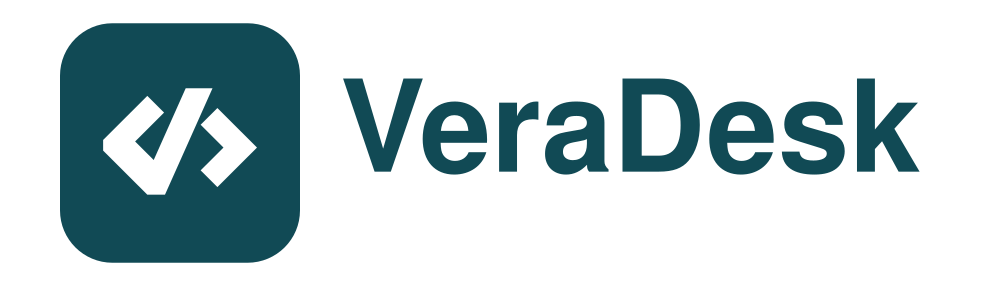

<p align="center">
  <br>
</p>

# VeraDesk

Veranilsoft'un kendi sunucusuna bağlı, açık kaynak uzak masaüstü istemcisi.
Windows, macOS ve Android üzerinde çalışır. İndirme: [Releases](https://github.com/veranilsoft/veradesk/releases) · [veranilsoft.com](https://veranilsoft.com)

## Özellikler

- Kendi ID/relay sunucusu (`rd.veranilsoft.com`), üçüncü taraf sunucu yok.
- Kalıcı şifre ile gözetimsiz erişim; bağlanan tarafta "şifreyi hatırla" varsayılan açık.
- Dosya transferi, port yönlendirme, terminal, kamera görüntüleme, çoklu monitör.
- Uçtan uca şifreli bağlantı (NaCl / DTLS), sunucu trafiği göremez.

## Derleme

Sürüm sabitleri `.github/workflows/veradesk-release.yml` içindedir (Rust 1.81, Flutter 3.24.5, vcpkg baseline, NDK r28c).

```bash
# macOS (Apple Silicon)
brew install nasm cmake ninja pkg-config llvm create-dmg
export VCPKG_ROOT=$HOME/vcpkg
$VCPKG_ROOT/vcpkg install --triplet arm64-osx --x-install-root=$VCPKG_ROOT/installed
flutter_rust_bridge_codegen --rust-input ./src/flutter_ffi.rs --dart-output ./flutter/lib/generated_bridge.dart --c-output ./flutter/macos/Runner/bridge_generated.h
python3 build.py --flutter
```

Windows ve Android için adımlar iş akışı dosyasındaki ilgili job'larda birebir yazılıdır.
`v*` etiketi push edildiğinde üç platform da otomatik derlenir ve GitHub Release'e yüklenir.

## Sunucu

`hbbs` (ID) + `hbbr` (relay), Docker ile. Ayrıntılar `VERADESK.md` ve sunucu deposundaki `docker-compose.yml` içinde.

## Lisans

AGPL-3.0. Bu proje, AGPL-3.0 lisanslı bir açık kaynak uzak masaüstü projesinin
(<https://github.com/rustdesk/rustdesk>) türevidir; orijinal telif bildirimleri
`LICENCE` dosyasında korunmuştur. Üst projenin adı ve logosu bu projede kullanılmaz.
